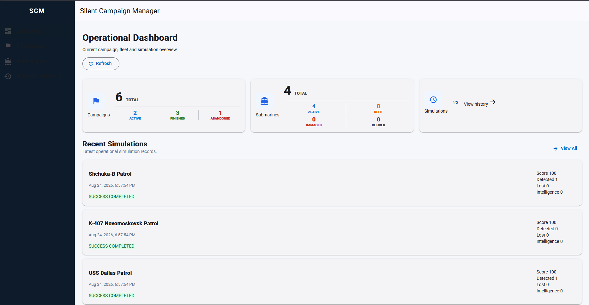
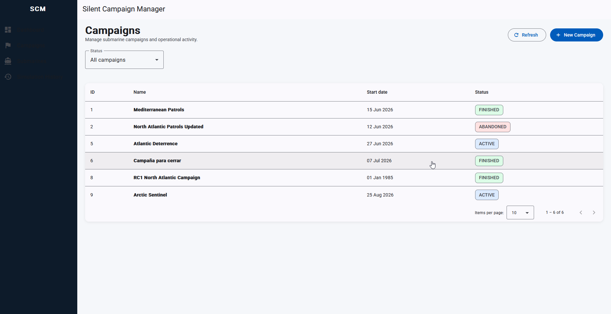
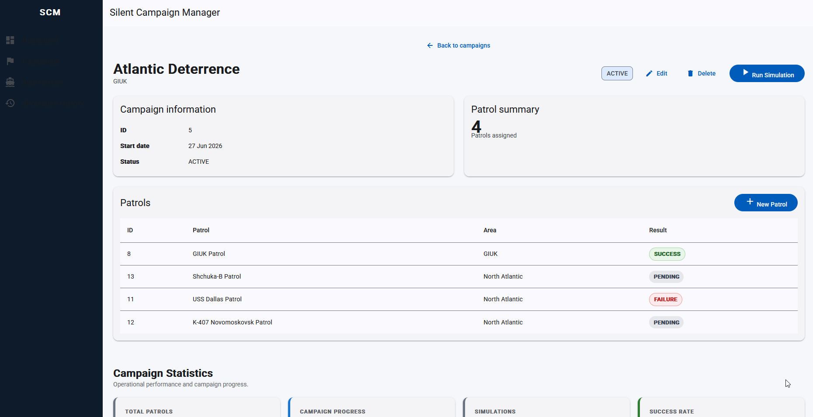
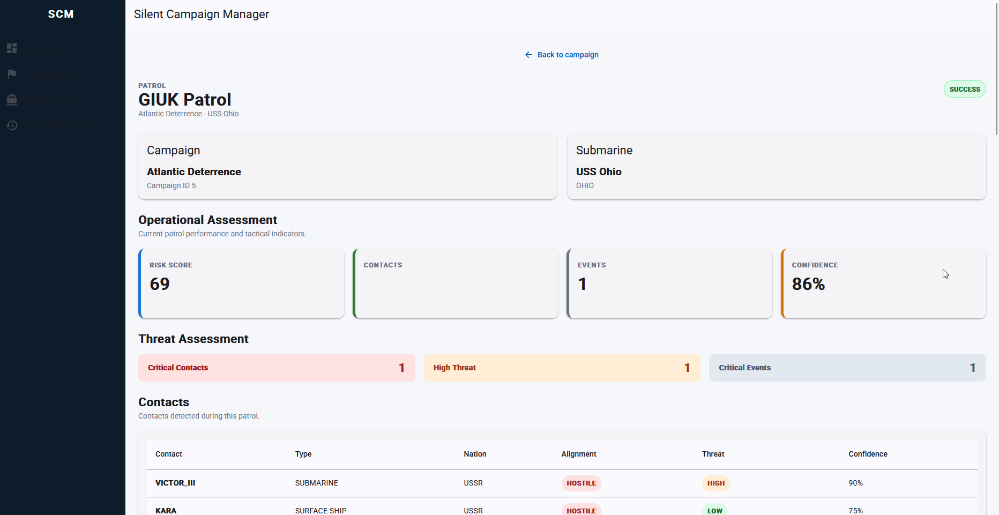
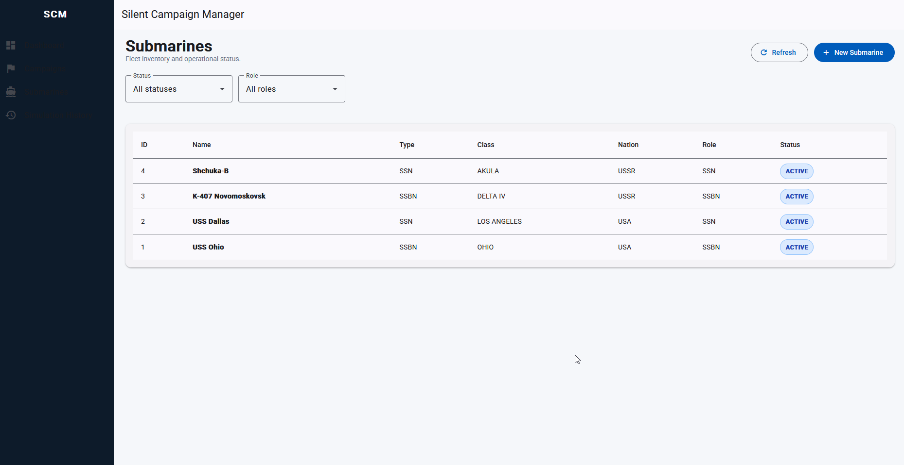
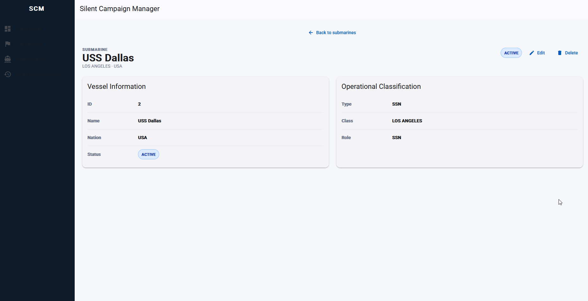
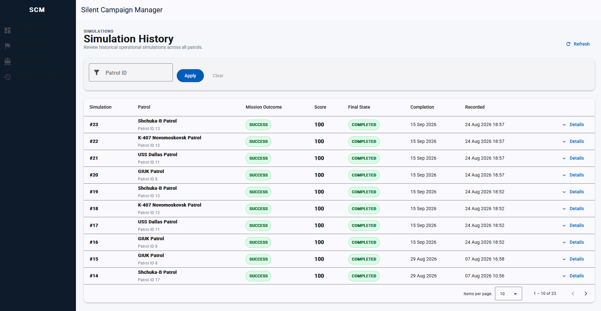

# Silent Campaign Manager UI

Angular frontend for **Silent Campaign Manager**, a Cold War SSBN campaign management and simulation application.

This repository contains the user interface for the Silent Campaign Manager full-stack project. It provides an operational dashboard and interfaces for managing campaigns, patrols, submarines and simulation history while communicating with a Spring Boot REST API secured with JWT authentication.



## Features

### Operational Dashboard

- Campaign, submarine and simulation overview.
- Campaign status summary:
  - Active
  - Finished
  - Abandoned
- Submarine fleet status summary:
  - Active
  - Refit
  - Damaged
  - Retired
- Recent simulation activity.
- Direct navigation from dashboard metrics to filtered campaign and submarine views.
- Direct navigation from recent simulations to their associated patrols.

### Campaign Management

- List and paginate campaigns.
- Filter campaigns by status.
- Create and edit campaigns.
- View campaign details and associated patrols.
- Finish or abandon active campaigns.
- Navigate directly from dashboard status metrics to filtered campaign lists.





### Patrol Management

- Create patrols within campaigns.
- View and edit patrol details.
- Close pending patrols and display their final mission result.
- View simulation history associated with a patrol.
- Navigate from simulation records back to their patrol.



### Submarine Fleet Management

- List the submarine fleet.
- Filter submarines by operational status and role.
- Create and edit submarines.
- View submarine details.
- Navigate directly from dashboard fleet metrics to filtered submarine lists.





### Simulation History

- Browse global simulation history.
- Filter simulation records by patrol.
- Inspect simulation details including:
  - Mission outcome
  - Mission score
  - Final state
  - Contacts detected and lost
  - Intelligence gathered
  - Incidents
  - Mission debrief
- Navigate from simulation history to the corresponding patrol.



## Tech Stack

- **Angular 22**
- **Angular Material 22**
- **TypeScript 6**
- **RxJS 7**
- **SCSS**
- **JWT authentication**
- **Angular Router**
- **Angular HttpClient**

The frontend communicates with a Java 21 / Spring Boot backend backed by PostgreSQL.

## Architecture

The application follows a feature-oriented Angular structure:

```text
src/app/
├── core/
│   └── auth/
├── features/
│   ├── auth/
│   ├── campaigns/
│   ├── dashboard/
│   ├── patrols/
│   ├── simulations/
│   └── submarines/
└── layout/
```

The main application areas are separated into feature modules/components, while authentication infrastructure is kept under `core`.

## Backend Integration

During local development, Angular runs on:

```text
http://localhost:4200
```

The Spring Boot API runs on:

```text
http://localhost:8080
```

API requests use the `/api` prefix and are forwarded to the backend through `proxy.conf.json`.

```text
Angular UI :4200
      │
      │ /api
      ▼
proxy.conf.json
      │
      ▼
Spring Boot API :8080
      │
      ▼
PostgreSQL
```

## Authentication

The application uses JWT-based authentication.

After a successful login:

1. The backend returns an access token.
2. The frontend stores the token locally.
3. An HTTP interceptor adds the token to protected API requests:

```text
Authorization: Bearer <token>
```

Protected application routes use an Angular route guard.

## Getting Started

### Prerequisites

Make sure the following are installed:

- Node.js
- npm
- Angular CLI
- Silent Campaign Manager backend

The backend must be running on port `8080` for the default development proxy configuration.

### Install Dependencies

Clone the frontend repository and install its dependencies:

````bash
git clone https://github.com/jastigi/silent-campaign-manager-ui.git
cd silent-campaign-manager-ui
npm install

### Start the Backend

Start the Silent Campaign Manager backend before running the frontend.

The REST API should be available at:

```text
http://localhost:8080
````

### Start the Frontend

Run Angular with the development proxy:

```bash
ng serve --proxy-config proxy.conf.json
```

Then open:

```text
http://localhost:4200
```

## Production Build

Create a production build with:

```bash
npm run build
```

The generated application is written to:

```text
dist/silent-campaign-manager-ui
```

## Main Routes

| Route                                           | Description               |
| ----------------------------------------------- | ------------------------- |
| `/`                                             | Operational dashboard     |
| `/campaigns`                                    | Campaign list             |
| `/campaigns/new`                                | Create campaign           |
| `/campaigns/:id`                                | Campaign details          |
| `/campaigns/:id/edit`                           | Edit campaign             |
| `/campaigns/:campaignId/patrols/new`            | Create patrol             |
| `/campaigns/:campaignId/patrols/:patrolId`      | Patrol details            |
| `/campaigns/:campaignId/patrols/:patrolId/edit` | Edit patrol               |
| `/submarines`                                   | Submarine fleet           |
| `/submarines/new`                               | Create submarine          |
| `/submarines/:id`                               | Submarine details         |
| `/submarines/:id/edit`                          | Edit submarine            |
| `/simulations`                                  | Global simulation history |

Campaign and submarine list routes also support status query parameters used by dashboard navigation, for example:

```text
/campaigns?status=ACTIVE
/submarines?status=REFIT
```

## Project Status

The frontend currently provides the main operational workflows required to interact with the Silent Campaign Manager backend:

- JWT authentication and protected routes
- Campaign lifecycle management
- Patrol lifecycle management
- Submarine fleet management
- Simulation history
- Operational dashboard
- Status filtering and dashboard deep-link navigation

Development is ongoing and additional functionality and UI refinements will be added incrementally.

## Roadmap

Planned areas for future development include:

- Additional dashboard and operational views
- Further UI/UX refinement
- Responsive design improvements
- Automated frontend test coverage
- Bundle and component stylesheet optimization
- Additional integration with backend simulation capabilities

## Backend Repository

This frontend is designed to work with the **Silent Campaign Manager** Spring Boot backend.

The backend repository contains the REST API, campaign simulation engine, persistence layer, JWT security and PostgreSQL integration.

[Silent Campaign Manager Backend](https://github.com/jastigi/silent-campaign-manager)

## Screenshots

Additional screenshots are available under:

```text
docs/images/
```

## Author

Developed by **jastigi** as a full-stack portfolio project focused on Java, Spring Boot and Angular.
